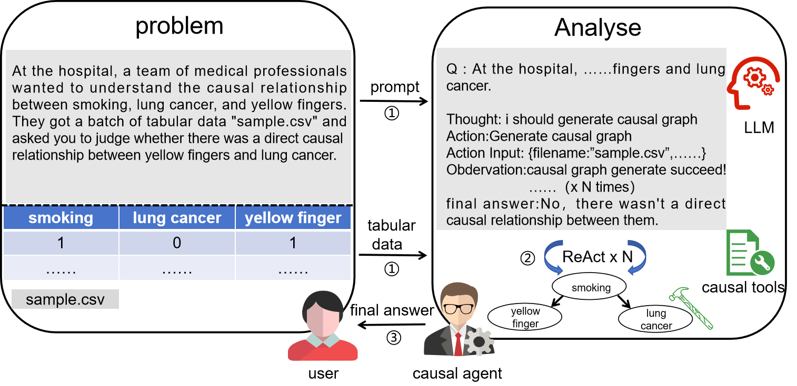
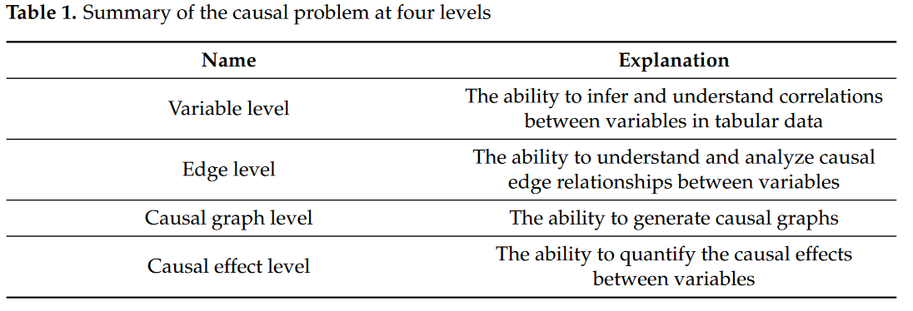
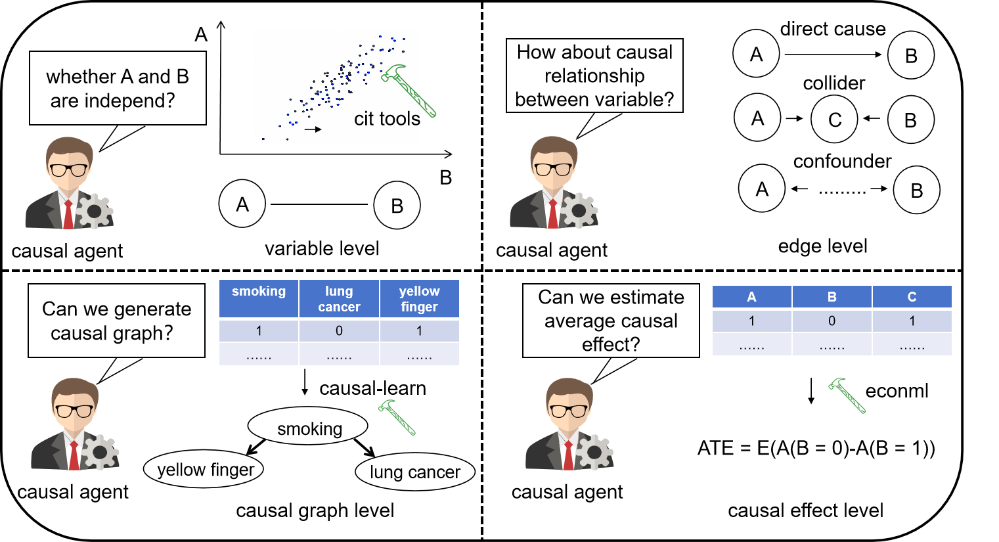
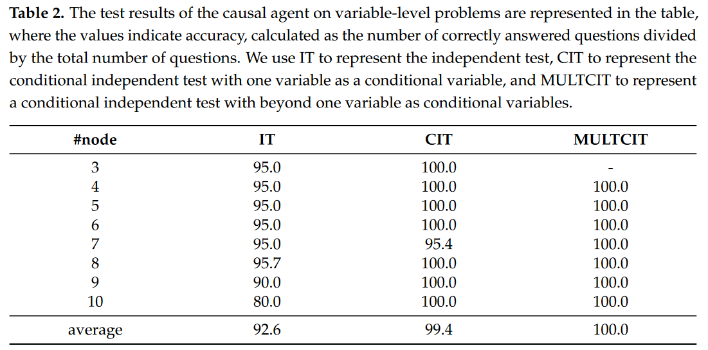
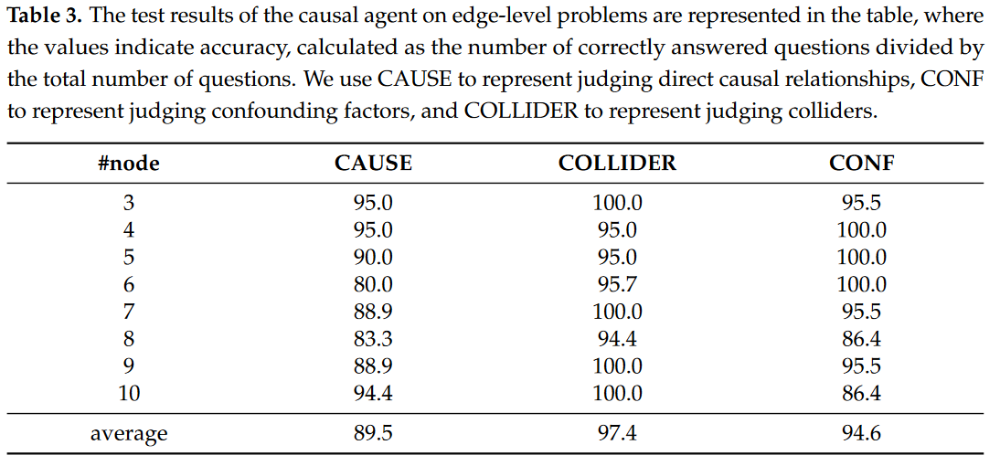
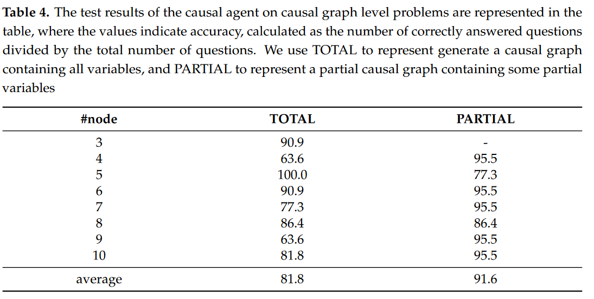
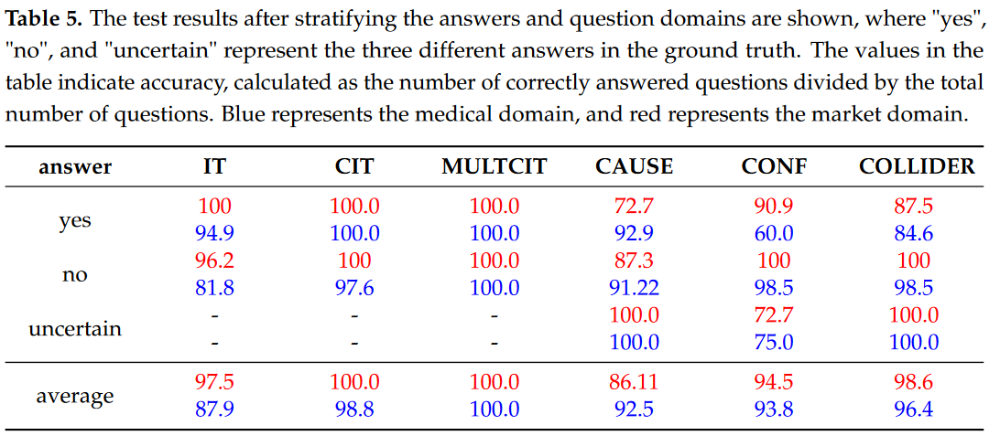

# Causal Agent based on Large Language Model 

## Abstract
Large language models (LLMs) have achieved significant success across various domains. However, the inherent complexity of causal problems and causal theory poses challenges in accurately describing them in natural language, making it difficult for LLMs to comprehend and use them effectively. Causal methods are not easily conveyed through natural language, which hinders LLMs' ability to apply them accurately. Additionally, causal datasets are typically tabular, while LLMs excel in handling natural language data, creating a structural mismatch that impedes effective reasoning with tabular data. This lack of causal reasoning capability limits the development of LLMs.
To address these challenges, we have equipped the LLM with causal tools within an agent framework, named the Causal Agent, enabling it to tackle causal problems. The causal agent comprises tools, memory, and reasoning modules. In the tools module, the causal agent applies causal methods to align tabular data with natural language. In the reasoning module, the causal agent employs the ReAct framework to perform reasoning through multiple iterations with the tools. In the memory module, the causal agent maintains a dictionary instance where the keys are unique names and the values are causal graphs.
To verify the causal ability of the causal agent, we established a benchmark consisting of four levels of causal problems: variable level, edge level, causal graph level, and causal effect level. We generated a test dataset of 1.3K using ChatGPT-3.5 for these four levels of issues and tested the causal agent on the datasets. Our methodology demonstrates remarkable efficacy on the four-level causal problems, with accuracy rates all above 80\%. For further insights and implementation details, our code is accessible via the GitHub repository https://github.com/Kairong-Han/Causal\_Agent

## Introduction
In recent years, generative artificial intelligence technology has gained significant success, achieving remarkable behavior in the natural language processing field~\cite{kocon2023chatgpt}, image, audio synthesis, etc~\cite{sakirin2023survey}.         This advancement lays the foundation for propelling research in general artificial intelligence~\cite{ge2024openagi}, both in terms of framework development and practical implementation.       However, due to the complexity of causal problems, the causal reasoning capabilities of the LLM remain insufficient. Causal theory is difficult to describe in natural language that the LLM can understand accurately. Researchers have evaluated the pure causal reasoning abilities of the LLM and found that their pure causal reasoning is close to random~\cite{jin2023large}. Additionally, researchers believe that the current LLM are merely "causal parrots" that mimic without truly possessing causal understanding~\cite{zečević2023causal}. This inherent limitation severely hampers the performance of large models in tasks requiring causal reasoning.
Moreover, causal datasets are typically tabular data, while large models excel in handling natural language data. When we need to draw causal conclusions based on the analysis of tabular data, LLMs that are not specifically designed cannot directly utilize tabular data and perform reasoning. This structural heterogeneity hinders LLM from effectively reasoning with tabular data. These two limitations restrict the ability of LLMs to solve causal problems effectively.

Several studies have emerged recently and attempted to use LLM as the core decision-making unit of intelligent agents and combine them with external tools to interact with the environment, thus achieving remarkable results in solving problems in specific fields. This type of technical strategy, which combines LLM with domain expertise, effectively improves the ability of LLM to solve problems by using external tools to empower agents in specific fields~\cite{wang2023survey}. For example,  ChatDev~\cite{qian2023communicative} proposes an end-to-end framework, where multiple agent roles communicate and collaborate through natural language conversations to complete the software development life cycle. ToolBench~\cite{qin2023toolllm}can be used for tasks such as code auto-completion and code recommendation. However, due to the lack of relevant tools and capabilities, it is difficult for agents to solve causal problems directly. 

To solve two difficult problems in sweetening the causal ability of LLM, we propose a causal problem modeling approach from the perspective of the LLM and propose a causal agent framework by guiding LLM to invoke causal tools. We model the causal problems into four levels: variable level, edge level, causal graph level, and causal effect level. The variable level focuses on the agent's judgment and understanding of correlations, the edge level focuses on the agent's examination of causal relationships between variables, the causal graph level focuses on the agent's ability to generate causal graphs, and the causal effect level focuses on the agent's estimation of causal effects between variables for quantitative expression. Based on the abovementioned causal problems, we construct a causal agent based on LLM, using ChatGPT-3.5. The causal agent is composed of tools, memory, and plan modules, as shown in Figure~\ref{fig:示意图}. In the tools module, the causal agent invokes the causal analysis library in Python programming tools, such as causal-learn~\cite{causallearn} and EconML~\cite{econml}.  So the causal agent can receive a pair of tabular data and a causal problem description of the data as input.  By invoking causal analysis tools, the tool processes the tabular data and generates natural language conclusions that the causal agent can understand. In the plan module, the causal agent utilizes its text comprehension and reasoning abilities to obtain answers to causal problems in many times iterations. In the memory module, the causal agent may need multiple tools to solve a problem. To preserve intermediate results during the planning process, the agent maintains an instantiated dictionary where the keys are names and the values are causal graphs. This special method allows the agent to retrieve the necessary causal graph using the key.
On the one hand, the content of the memory is expressed more richly; on the other hand, using a data structure rather than text as memory can effectively simplify the complexity of prompt design during the reasoning process. In this way, the causal agent achieved high accuracy in answering causal problems at four level questions, with accuracy rates of over 92\% in all three sub-problems for determining correlation at the variable level, over 89\% in all three sub-problems at the edge level, over 81\% in the causal graph level, and 93\% in the causal effect estimation level.   

This work contributions are summarized as follows:

+ A hierarchical modeling perspective has been proposed for LLM to solve causal problems. This is a new setting and the problem is set to be data-driven, where the LLM answers causal questions about tabular data when users input a pair of tabular data and causal questions. We focus on four level questions for causal agents to solve causal problems, denoted as variable level, edge level, causal graph level, and causal effect level. We propose a test set of approximately 1.3K in size for the four levels of problems, covering nine sub-problems in total at four levels;
+ The causal agent has been proposed to empower LLM with the ability to solve causal problems.  In this framework, we use LLM to invoke causal tools and iterate many times to analyze and solve causal problems.  Thus achieving heterogeneous data alignment between natural language input for large models and tabular data input for causal problems.  The causal agent framework that empowers causal reasoning through the use of causal tools has good Interpretability and reliability;

+ The causal agent achieved high accuracy in the four levels of causal problems modeled in this article. Specifically, all three sub-problems at the variable level achieved an accuracy of over 92\%, all three sub-problems at the edge level achieved an accuracy of over 89\%, all three sub-problems at the causal graph level achieved an accuracy of over 81\%, and all two sub-problems at the causal effect level achieved an accuracy of over 93\%;

## Method

### Causal Problem Modeling
Despite the development of LLM, like ChatGPT, demonstrating strong natural language understanding and question-answering capabilities, there is still a significant gap between the problem paradigms that data-driven causal focuses on tabular data but LLM focuses on the field of natural language processing. Furthermore, LLMs struggle to truly understand and handle the intricate causal relationships inherent in complex data. The inability of LLMs to adapt to causal tasks remains a significant limitation in their development and widespread reliable use.

Therefore, it is meaningful to re-establish a causal problem framework from the perspective of the LLM. This has a significant impact on evaluating the causal ability of LLMs and enhancing their causal ability. To model causal problems within the field of LLM, We formulate our settings as follows:

Let $T \in R^{n\times c}$be a tabular data with $n$ rows and $c$ columns, in which each row $t_i$ is a piece of data, and each column $c_i$ represents a variable. So 
$$T=\{t_i^c\}_{i=0}^{n}$$
We formalize the causal problem space as a $Q$ and $q_i \in Q$ is one question in the form of natural language. We combine the tabular data and the problem description by Cartesian product to create the dataset $D$ and each item $ d_i \in R^{n\times c} \times Q$.So

$$D = \{d_i\} = \{(T_i,q_i)\in R^{n\times c} \times Q \}$$

The user inputs a pair of $(T_i,q_i)$ samples from $D$, and then the causal agent analyses the tabular data $T_i$ and the causal problem $Q$ to generate a reasonable answer $A$. The format of answer $A$  is not limited to the form of natural language. $A$ can also be a causal graph or other heterogeneous non-textual data to explain the question clearly.

Due to the complex diversity of causal problems, we simplify the problem and conduct the necessary modeling.  We categorize the causal problems into four major levels, as shown in Table \ref{mytab1}, based on the differences in problem granularity and objects: variable level, edge level, causal graph level, and causal effect level.  The variable level corresponds to the first level of the causal ladder, correlation, aiming to endow LLM with the ability to infer and understand correlations between variables in tabular data.  The edge level builds beyond correlation, aiming to endow LLM with the ability to understand and analyze causal edge relationships between variables.  The causal graph level shifts the perspective to a more macroscopic dimension, examining the LLM's capabilities of generating causal graphs.  The causal effect level aims to endow LLM with the ability to quantify the causal effects between variables. We will discuss four levels of modeling methods in detail below.

### Causal Agent Framework

Based on the causal modeling methods mentioned in Section \ref{Modeling causal problems from the perspective of LLM}, we have specifically implemented causal agents with causal reasoning capabilities for different modeling granularities.    Our causal agent framework consists of three modules: tools module, memory module, and plan module.      In terms of tools, to align the tabular data with natural language, we invoke causal analysis tools that can accept tabular data as input.     For the output of tools, we use prompts to interpret and explain the results, enabling the causal agent to understand the output.   In the planning aspect, inspired by the ReAct framework~\cite{yao2023react}, through multiple rounds of reflection, we continuously invoke causal analysis tools and reflect on their output, considering whether we can derive the answer to the original question based on the agent's understanding of the causal question. If the answer to the question cannot be derived, we continue to iterate and reflect until we reach the final answer or limited iteration times.      Besides, to better understand tools' usage, we use in-context learning and one-shot examples to empower the causal agent. A manual handwritten example is designed to use all tools to guide the causal agent in invoking and understanding the tool.     In terms of memory, we store the output of the causal analysis tools in a dictionary in memory as short-term memory, ensuring that the agent can continuously access the causal graph before the final answer is obtained.

The causal agent invokes causal analysis tools to analyze tabular data, thereby compensating for the LLM's shortcomings in handling tabular data.       This approach aligns tabular data with causal conclusions and enhances the LLM's causal capabilities through tool invocation.       Specifically, our causal analysis tools select the library causal-learn for causal discovery and EconML for causal inference.       Starting from the perspective of modeling causal problems for the LLM, we have designed specific tool functions at the variable level, edge level, causal graph level, and causal effect level.       To make the tool functions easily invoked by the LLM, we have re-encapsulated the interfaces, changing the tool inputs to JSON string format, and using manual rules and handwritten prompt templates to help the large model better understand the meaning of the tool outputs.  Prompt details are in the appendix.

At the variable level, we invoke the conditional independent test class in causal-learn and use Fisherz~\cite{fisher1921014} as an independent test method.    At the causal graph level, since there are no unobserved variables in our data assumptions, we invoke the PC algorithm to generate the Markov equivalence class of the causal graph.       It should be noted that when generating a partial causal graph, we still use the PC algorithm.       However, in this case, the variables not included in arguments are unobserved variables for partial causal graphs.    we think that this situation should be controlled by the user rather than the agent actively changing the causal discovery algorithm, such as the FCI~\cite{spirtes2013causal}algorithm that can handle unobserved confounders.       This design maintains the reliability of the agent's behavior and facilitates user interaction with the agent.

At the edge level, we use the tool's prompt template to guide the LLM to use the causal graph generation algorithm and obtain the Markov equivalence class of the causal graph. Then judge the relationship between the edges.       For undirected edges that the PC algorithm cannot determine,  the tools will categorically discuss the direction of the edge to conclude.      We focus on three sub-issues at edge level: direct cause,  confounding, and collider.       For judging the cause relationship, we consider whether there is a directed edge directly connecting the two variables in the output $G$ of the PC algorithm.       If such a directed edge exists, the agent will determine the cause relationship based on the direction of the edge;       For judging confounding, we consider whether there exist unblocked backdoor paths between the two nodes.       If unblocked backdoor paths exist, the tool class will return the backdoor path. The causal agent will receive information about the presence of confounding.       For judging a collider, we only consider the collider "V" structure, such as $V_i\xrightarrow[]{}V_k\xleftarrow[]{}V_j.$

At the level of causal effects, the causal agent invokes the LinearDML algorithm in the EconML library, where the user needs to specify which variables are covariates. The causal agent first uses the LinearDML algorithm to train the data.   During the training stage, we choose the default parameters of the LinearDML algorithm in the EconML library, and the covariates are specified by the user's prompts input.   After the training stage, the tool outputs an estimator of the average causal effect on the same model, using covariates consistent with those used during training.   It should be emphasized that the default parameters of the LinearDML algorithm depend on the linear treatment assumption and linear heterogeneity assumption of the data.   Actual test data and real-world scenario data may not meet similar assumptions, so there may be biases in the average causal effects produced. Our focus is mainly on the process of calling and understanding tools for the causal agent, while the selection of models is a more challenging aspect that can be further explored in future work.

##  Results

To test our causal intelligence agent, we start from the perspective of causal question modeling in Section \ref{Modeling causal problems from the perspective of LLM} and have designed a series of question templates for variable-level, edge-level, causal graph-level, and causal effect-level respectively, details in the appendix. To obtain the data required for causal questions, we have generated tabular data using the nonlinear additive gaussian noise method~\cite{rolland2022scorematchingenablescausal}. In addition, for questions at the variable level, edge level, causal graph level, and causal effect level, we have constructed a dataset of size 1.3K for testing by using  ChatGPT-3.5, as shown in Figure \ref{fig:数据生成过程}. Through testing, our causal agent has achieved high accuracy over four-level questions. All three sub-problems at the variable level achieved an accuracy of over 92\%, all three sub-problems at the edge level achieved an accuracy of over 89\%, all three sub-problems at the causal graph level achieved an accuracy of over 81\%, and all two sub-problems at the causal effect level achieved an accuracy of over 93\%;
To generate the tabular data needed for the test dataset, we adopt the method used in the work by \citet{rolland2022scorematchingenablescausal}. Specifically, our data follows non-linear additive Gaussian noise models, $X \in R^d$ is generated using the following model:
$$X_i = f_i(pa_i(X) )+ \epsilon_i $$
$ i = 1, \dots,d$ , where  $pa_i(X)$ selects the coordinates of  $X$  which are parents of node $i$ in some DAG.The noise variables $$ \epsilon \sim \mathcal{N}(0, \sigma^2)$$ The functions $f_i$ are assumed to be twice continuously differentiable and non-linear in every component. That is, if we denote the parents  $pa_j (X)$ of  $X_j$  by  $X_{k1}, X_{k2}, \dots, X_{kl}$ , then, for all  $a = 1, \dots, l$ , the function  $f_j(X_{k1}, \dots,X_{k_{a-1}},\cdot,X_{k_{a+1}},\dots,X_{kl} )$  is assumed to be nonlinear for some  $X_{k1}, \dots,X_{k_{a-1}},\cdot,X_{k_{a+1}},\dots,X_{kl} \in R^{l - 1}$ 

Through the aforementioned method, we have generated a series of tabular data with node counts ranging from 3 to 10. For tables with the same number of nodes, we generate a series of tabular data with different edge numbers, which range in $ [0,C_{\#node}^2]$. This simulates different scenarios of sparsity and density of real causal graphs. We use all the generated tabular data as a data pool. When generating specific test samples later, we will randomly take a table from the table pool that has the same number of nodes as variables required by the question, to be a quantitative expression of the relationships between variables. 

## Conclusion

In this work, we harnessed LLM to construct a causal agent by invoking causal tools, modeling causal problems across four levels in the causal domain, and endowing the large model with causal capabilities at four levels, followed by an assessment of the agent's abilities. The experimental results of the agent in solving causal problems showed that it performed particularly well at the variable level. In tasks of independence testing, accuracy rates exceeded 92\% and even reached 100\% in the multi-conditional independence test. This endowed the agent with the ability to leverage correlation analysis driven by tabular data. At the edge level, the agent achieved accuracy rates of over 89\% in judging direct causal relationships, confounding factors, and colliders, indicating its high capability in handling causal relationships. At the causal graph level, the accuracy rates for generating complete and partial causal graphs were 81.8\% and 91.6\%, respectively, demonstrating the agent's potential in constructing causal relationship networks using data-driven approaches and causal tools. The agent can correctly invoke tools and generate causal graphs, which is significant for the popularization of the causal community and the automation of causal tools. Even users who are not familiar with the concept of causality can utilize the agent to produce an end-to-end process from data to causal graphs. At the causal effect level, the agent can produce the correct average causal effect, achieving an accuracy rate of 93\% on our small-scale dataset.

Moreover, the use of causal tools ensures interpretability and reliability, which is of great significance for the future practical application of the causal agent.

Analyzing the agent's errors, we can find that there is a bias in the agent's understanding and application of causal tools, leading to a decrease in accuracy in some cases. However, this issue will be gradually resolved as the capabilities and generalization performance of large models improve. From this perspective, causal scientists can focus on improving the interaction efficiency and accuracy of the agent and causal tools. As the capabilities of LLM are enhanced in the future, the agent's causal inference capabilities will also increase accordingly. Additionally, the agent's performance varies across different domains (such as marketing and medical), indicating that domain-specific knowledge and further domain adaptation may help improve the agent's performance. Addressing the issue of poor robustness of the agent in different domains will greatly affect the practical application of the causal agent. Moreover, the current causal agent cannot select models and perceive data. The agent in this work only directly invokes simple causal models, such as the PC algorithm and LinearDML algorithm, but the applicability of these algorithms is limited and heavily relies on our functional assumptions about the data and the assumption of no confounding. How to endow the agent with the ability to perceive data and to have prior understanding and knowledge of tool invocation is of great significance for the agent's promotion and practical application. 

# How to run the code

## data generation

### tabular data
use the method in Score matching enables causal discovery of nonlinear additive noise models", Rolland et al., ICML 2022.

    ./SCORE-main/demo_SCORE.py

### causal question description

generate gpt api instance

    ./DGP_description/gpt_api.py

generate causal question description by GPT-3.5

    DGP_description/DGP.py

generate ground truth of causal question by classic algorithm 

    DGP_description\dataset_gt.py

tabular data is stored in [data dir](DGP_description/data)

causal graph is stored by text format in [causal_graph dir](DGP_description/causal_graph)

note that generated causal graphes doesn't reflect truth causal relationship in real world, but only reflect the causal relationship in the simulation.

### combine tabular data and description

the final data set is stored in 

    result_5_18_icl_medical.jsonl
    result_5_18_icl_market.jsonl
    result_gpt_3.5_ICL\result_ate.jsonl

file format is as follow:

    {"node num": #the number of nodes in the causal graph, 
    "question_type": #question type we care about, 
    "interest": [#variables list we will focus in the question ], 
    "variables": [#all variables in the causal graph], 
    "text": # question scenario description in natural language, 
    "file": #tabular data file we use in this question, 
    "Q": #question body in natural language, 
    "gt": #ground truth, 
    "output": #predicted answer which is generated by causal agent constructed by GPT-3.5 and use ICL method, 
    "match"(optional): # whether generated causal graph is right in CAUSALKG and PARTIAL question }

## Causal Agent

implemented in 

    main.py

we ues gpt-3.5-turbo in this work,if you want to alter by other llm , you can change the code in line 323 to other model. To generate output, line 417 is the main code.

    line 417: resp = agent_executor.invoke({"input": q})

the causal question result already written in the following files:

    result_5_18_icl_medical.jsonl
    result_5_18_icl_market.jsonl
    result_gpt_3.5_ICL\result_ate.jsonl

## check the result and calculate the accuracy

the causal question result already written in the files.

you can check the result by open the jsonl file and check whether the "gt" and the "output"(json format like {'answer':'xxx'}) are matched, or output is "MATCH" directly means the generated causal graph is right in CAUSALKG and PARTIAL question.Compare the value of output and gt in ATE question.

tongji.py and jisuan.py are python code calculate the accuracy of the result swiftly. You can  change the input and run the code to satisfy your need.
