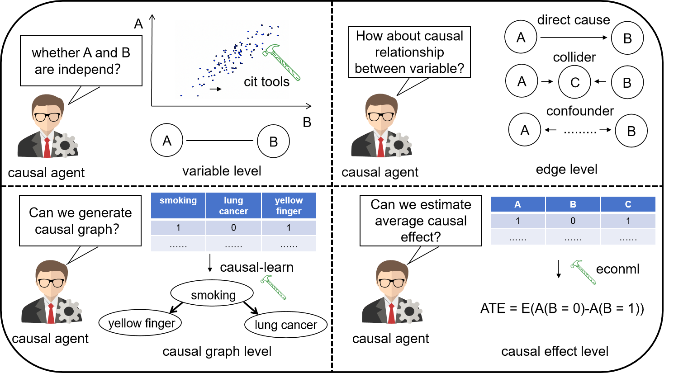

# Causal Agent based on Large Language Model 

# Introduction
The large language model (LLM) has achieved significant success across various domains. However, the inherent complexity of causal problems and causal theory poses challenges in accurately describing them in natural language, making it difficult for LLM to comprehend and use them effectively. Causal methods are not easily conveyed through natural language, which hinders LLM's ability to apply them accurately. Additionally, causal datasets are typically tabular, while LLM excels in handling natural language data, creating a structural mismatch that impedes effective reasoning with tabular data. This lack of causal reasoning capability limits the development of LLM.
To address these challenges, we have equipped the LLM with causal tools within an agent framework, named the Causal Agent, enabling it to tackle causal problems. The causal agent comprises tools, memory, and reasoning modules. In the tool module, the causal agent calls Python code and uses the encapsulated causal function module to align tabular data with natural language. In the reasoning module, the causal agent performs reasoning through multiple iterations with the tools. In the memory module, the causal agent maintains a dictionary instance where the keys are unique names and the values are causal graphs.
To verify the causal ability of the causal agent, we established a \underline{\textbf{Causal}} \underline{\textbf{T}}abular \underline{\textbf{Q}}uestion  \underline{\textbf{A}}nswer (CausalTQA) benchmark consisting of four levels of causal problems: variable level, edge level, causal graph level, and causal effect level. CausalTQA consists of about 1.4K for these four levels questions. Causal agent demonstrates remarkable efficacy on the four-level causal problems, with accuracy rates all above 80\%. Through verification on the real-world dataset QRData, the causal agent is 6\% higher than the original SOTA, demonstrating its strong generalization ability in real-world scenarios.

# How to run the code

## data generation

### tabular data
use the method in Score matching enables causal discovery of nonlinear additive noise models", Rolland et al., ICML 2022.

    ./SCORE-main/demo_SCORE.py

### causal question description

generate gpt api instance

    ./DGP_description/gpt_api.py

generate causal question description by GPT-3.5

    DGP_description/DGP.py

generate ground truth of causal question by classic algorithm 

    DGP_description\dataset_gt.py

tabular data is stored in [data dir](DGP_description/data)

causal graph is stored by text format in [causal_graph dir](DGP_description/causal_graph)

note that generated causal graphes doesn't reflect truth causal relationship in real world, but only reflect the causal relationship in the simulation.

### combine tabular data and description

the final data set is stored in 

    result_5_18_icl_medical.jsonl
    result_5_18_icl_market.jsonl
    result_gpt_3.5_ICL\result_ate.jsonl

file format is as follow:

    {"node num": #the number of nodes in the causal graph, 
    "question_type": #question type we care about, 
    "interest": [#variables list we will focus in the question ], 
    "variables": [#all variables in the causal graph], 
    "text": # question scenario description in natural language, 
    "file": #tabular data file we use in this question, 
    "Q": #question body in natural language, 
    "gt": #ground truth, 
    "output": #predicted answer which is generated by causal agent constructed by GPT-3.5 and use ICL method, 
    "match"(optional): # whether generated causal graph is right in CAUSALKG and PARTIAL question }

## Causal Agent

implemented in 

    main.py

we ues gpt-3.5-turbo in this work,if you want to alter by other llm , you can change the code in line 323 to other model. To generate output, line 417 is the main code.

    line 417: resp = agent_executor.invoke({"input": q})

the causal question result already written in the following files:

    result_5_18_icl_medical.jsonl
    result_5_18_icl_market.jsonl
    result_gpt_3.5_ICL\result_ate.jsonl

## check the result and calculate the accuracy

the causal question result already written in the files.

you can check the result by open the jsonl file and check whether the "gt" and the "output"(json format like {'answer':'xxx'}) are matched, or output is "MATCH" directly means the generated causal graph is right in CAUSALKG and PARTIAL question.Compare the value of output and gt in ATE question.

tongji.py and jisuan.py are python code calculate the accuracy of the result swiftly. You can  change the input and run the code to satisfy your need.

## baselines

### QRdata
file folder: QRData/
ours code: main_QR.py

## resGPT

file folder: baseline-RestGPT

## Citation
If our work assists your research, feel free to cite us using:

    @article{han2024causal,
    title={Causal agent based on large language model},
    author={Han, Kairong and Kuang, Kun and Zhao, Ziyu and Ye, Junjian and Wu, Fei},
    journal={arXiv preprint arXiv:2408.06849},
    year={2024}
    } 